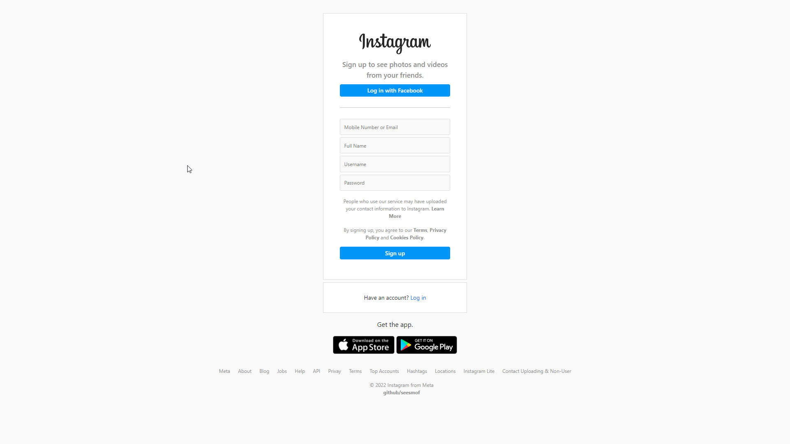

  

<h3 align="center">Instagram Sing Up Page</h3>

---

 Instagram Sing Up Page
     

## 📝 Table of Contents

- [About](#about)
- [Built Using](#built_using)
- [Authors](#authors)
- [Acknowledgments](#acknowledgement)

## 🧐 About 

Simple one-page HTML and CSS project of an Instagram Sing Up Page. Made in free time using HTML, CSS, SASS and Bootstrap

## 🚀 Deployment 

- [Live View](https://seesmof.github.io/instagram-sign-up/)

## ⛏️ Built Using 

- [HTML](https://www.w3.org/html/) - Markup Language
- [CSS](https://www.w3schools.com/css/) - Styling Language
- [SASS](https://sass-lang.com/) - CSS Pre-Processor
- [TailwindCSS](https://tailwindcss.com/) - CSS Framework

## ✍️ Authors 

- [@seesmof](https://github.com/seesmof) - Idea & Initial work

## 🎉 Acknowledgements 

- [Instagram](https://www.instagram.com/accounts/emailsignup/) for neat page design
